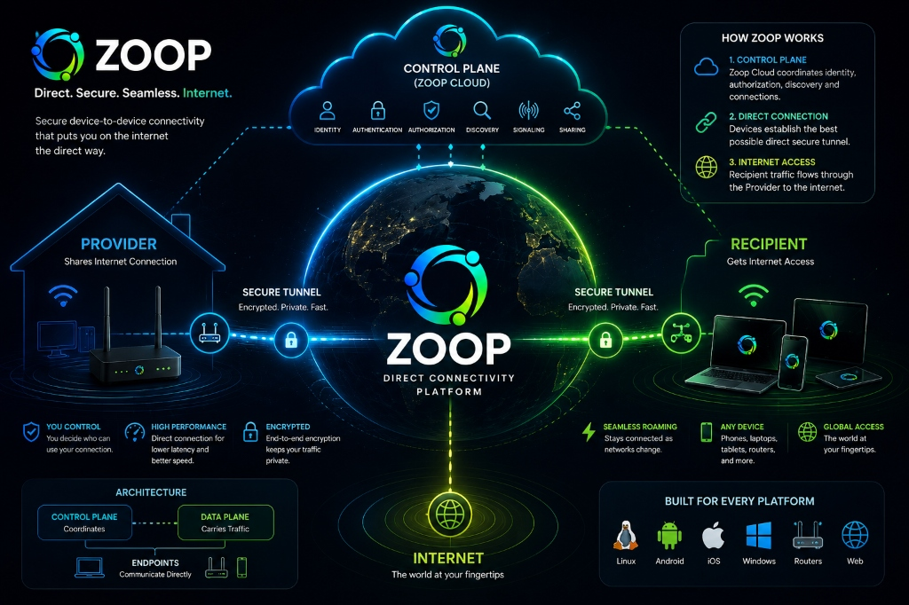

# Zoop



Zoop is a direct connectivity platform designed to let authorized devices
share and use network connectivity through secure, fast, and reliable
device-to-device connections.

The core idea is simple:

    Provider
        │
        │ secure direct connection
        ▼
    Recipient
        │
        ▼
     Internet


## Vision

Zoop aims to make device-to-device connectivity:

- Fast
- Direct
- Secure
- Reliable
- Seamless
- Easy to use

The architecture separates coordination from traffic:

    ┌─────────────────────────────────────────┐
    │                  ZOOP                   │
    │                                         │
    │   Control Plane       Data Plane        │
    │   ─────────────       ─────────         │
    │   Identity            Endpoints         │
    │   Authorization       Secure Tunnel     │
    │   Discovery           Routing           │
    │   Signaling           Forwarding        │
    │   Sharing             NAT                │
    │                                         │
    └─────────────────────────────────────────┘


## Core Architecture

The Control Plane coordinates the network.

The Data Plane carries the actual traffic.

Direct endpoint connectivity is preferred.

Relays are a fallback when direct connectivity cannot be established.

    Control Plane
         │
         ├── Identity
         ├── Authentication
         ├── Authorization
         ├── Discovery
         ├── Signaling
         └── Sharing
                 │
                 ▼
          Secure Connection
                 │
                 ▼
        Provider ↔ Recipient
                 │
                 ▼
              Internet


## Technology

The current technology direction is:

    Core / Backend       → Go
    Networking           → Go
    Endpoint Agent       → Go
    Router               → Go
    Android              → Kotlin
    iOS                  → Swift
    Web                  → TypeScript + React

The secure tunnel will use an established technology rather than a
custom cryptographic protocol.

WireGuard is the current direction for the secure tunnel layer.


## Repository Structure

    zoop/
    │
    ├── README.md             # High-level overview & current progress
    ├── ROADMAP.md            # Detailed 22-milestone implementation checklist
    │
    ├── docs/                 # Architectural specifications
    │   ├── architecture.md
    │   ├── entities.md
    │   ├── control-plane.md
    │   ├── data-plane.md
    │   ├── networking.md
    │   ├── security.md
    │   ├── platforms.md
    │   ├── organizations.md
    │   ├── technology.md
    │   ├── api.md
    │   ├── abuse-and-safety.md
    │   ├── ipam-and-relays.md
    │   └── future.md
    │
    ├── cloud/
    ├── agent/
    ├── web/
    ├── mobile/
    ├── router/
    ├── packages/
    ├── tests/
    ├── deployments/
    ├── infrastructure/
    ├── scripts/
    └── .github/


## Documentation Architecture

Zoop uses three distinct documentation layers:

```text
docs/
   ↓
WHAT ZOOP IS
Architecture, entities, networking, security, technology...

README.md
   ↓
WHERE ZOOP IS
Project overview + current implementation progress

ROADMAP.md
   ↓
WHAT WE BUILD NEXT
Concrete tasks inside each of the 22 implementation milestones
```

### Core Architecture Documents

Start with:
- [Architecture](docs/architecture.md)

Then:
- [Entities](docs/entities.md)
- [Control Plane](docs/control-plane.md)
- [Data Plane](docs/data-plane.md)
- [Networking](docs/networking.md)
- [Security](docs/security.md)
- [Platforms](docs/platforms.md)
- [Organizations](docs/organizations.md)
- [Technology](docs/technology.md)
- [API Specification](docs/api.md)
- [Abuse & Safety](docs/abuse-and-safety.md)
- [IPAM & Relays](docs/ipam-and-relays.md)

For future direction:
- [Future Ideas](docs/future.md)


## Implementation Progress & Roadmap

Track detailed tasks in [ROADMAP.md](ROADMAP.md). Below is the high-level status of our 22 implementation milestones:

- [x] **Milestone 1: Repository Foundation** (Clean build, CI, linting, directory structure)
- [x] **Milestone 2: Go Core** (Core types, Device, Provider, Recipient, Identity, Connection primitives)
- [x] **Milestone 3: Zoop Agent** (Agent CLI, lifecycle, identity creation, local storage, status)
- [x] **Milestone 4: Control Plane** (Go Cloud service, API, Registration, Auth, Discovery, Signaling)
- [x] **Milestone 5: Agent ↔ Control Plane** (Agent-Cloud sync, peer lookup, signaling)
- [x] **Milestone 6: Secure Tunnel** (WireGuard integration, key management, peer configuration)
- [x] **Milestone 7: Real Packet Forwarding** (Data Plane: packet routing, TCP/UDP forwarding)
- [x] **Milestone 8: Real Internet Traffic** (Provider NAT, DNS, HTTP/HTTPS browsing via Provider)
- [x] **Milestone 9: Direct Connectivity** (Local & public address discovery, direct P2P connection)
- [ ] **Milestone 10: NAT Traversal** (STUN, UDP hole punching, NAT-to-NAT connectivity)
- [ ] **Milestone 11: Relay Fallback** (Relay service, automatic fallback & promotion)
- [ ] **Milestone 12: Connection Recovery** (Roaming, Wi-Fi ↔ Cellular, IP changes, auto-reconnect)
- [ ] **Milestone 13: Security Hardening** (Key rotation, revocation, secret management, threat testing)
- [ ] **Milestone 14: Platform Implementations** (Linux Agent, Android Kotlin VPN, iOS Swift NetworkExtension)
- [ ] **Milestone 15: Router** (OpenWrt/Linux router Provider mode & multi-device gateway)
- [ ] **Milestone 16: Web Application** (React + TypeScript dashboard for accounts, devices & orgs)
- [ ] **Milestone 17: Observability** (Agent/Cloud logs, connection health, user diagnostics)
- [ ] **Milestone 18: Real-Network Validation** (Cross-network testing: Wi-Fi, Cellular, NAT, IPv4/IPv6)
- [ ] **Milestone 19: Performance Optimization** (Latency, throughput, CPU, memory, direct vs relay metrics)
- [ ] **Milestone 20: Production Infrastructure** (Cloud deployment, PostgreSQL, TLS, CI/CD)
- [ ] **Milestone 21: Production Hardening** (Security audit, load testing, privacy review)
- [ ] **Milestone 22: Complete System Validation** (End-to-end verification across all layers)


## What Zoop Is Not

Zoop is not designed around a centralized VPN gateway through which all
traffic must pass.

Zoop Cloud should not become the normal Internet traffic path.

Zoop is also not intended to invent a new cryptographic protocol.


## Current Architectural Goal

The target system is:

    User
      │
      ▼
    Identity
      │
      ▼
    Authorization
      │
      ▼
    Provider ↔ Secure Tunnel ↔ Recipient
                              │
                              ▼
                           Internet

with the Control Plane coordinating the relationship and connection.


## Long-Term Direction

Zoop may eventually support:

- multiple providers
- network-to-network connectivity
- routers
- organizations
- advanced policies
- failover
- multi-path networking
- embedded devices
- larger distributed networks

These are future directions, not current implementation requirements.


## Important

The documents in `docs/` describe the architecture in detail, and [ROADMAP.md](ROADMAP.md) tracks step-by-step progress.

This README intentionally stays high-level.

When implementation begins, work through tasks sequentially starting at **Milestone 1: Repository Foundation**.
