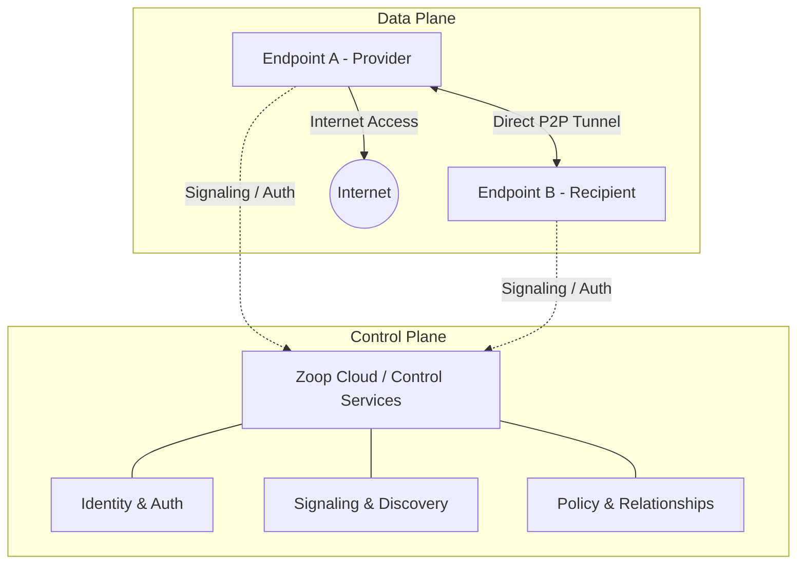

# Architecture

This document describes the complete conceptual architecture for Zoop.

## High-Level Diagram

## Control Plane vs Data Plane

Zoop follows a strict separation of concerns between the control plane and data plane:

- **Control Plane**: Operates in the Zoop Cloud and handles metadata, discovery, authentication, and signaling. It helps endpoints find each other and establish trust.
- **Data Plane**: Operates on the endpoints themselves. Once connections are established, traffic flows directly between endpoints. The data plane is responsible for the actual tunnel, encryption, and routing of Internet traffic.

## Zoop Cloud and Endpoints

- **Zoop Cloud**: The central infrastructure hosting the control plane.
- **Endpoints**: The user devices (phones, laptops, routers) that run the Zoop agent and participate in the data plane. Endpoints can act as providers (sharing bandwidth) or recipients (consuming bandwidth).
