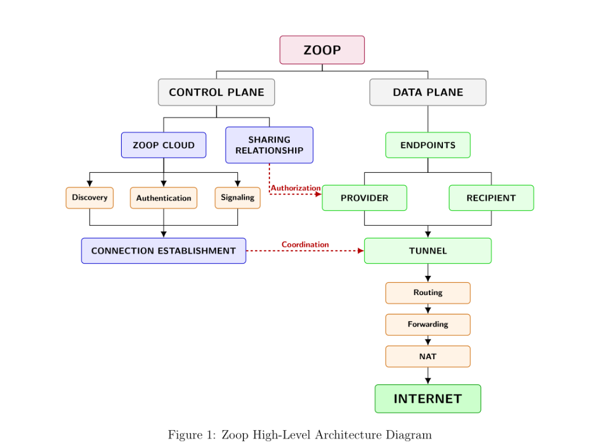

# Zoop Architecture



## 1. Overview

Zoop is a distributed connectivity system designed to allow network-capable endpoints to provide and receive Internet connectivity through controlled relationships.

A Zoop endpoint may be a phone, laptop, router, custom network device, or another supported platform.

The core idea is:

```text
Provider Endpoint
       │
       │
       │     Zoop
       │
       ▼
Recipient Endpoint
       │
       ▼
   Internet
```

Zoop separates the system into two major planes:

```text
                         ZOOP
                           │
          ┌────────────────┴────────────────┐
          │                                 │
     CONTROL PLANE                      DATA PLANE
          │                                 │
      Zoop Cloud                        Endpoints
          │                                 │
 ┌────────┼─────────┐              ┌────────┴────────┐
 │        │         │              │                 │
Identity Discovery Authorization Provider         Recipient
 │        │         │              │                 │
 └────────┴─────────┘              └────────┬────────┘
                                            │
                                          Tunnel
                                            │
                                         Routing
                                            │
                                       Forwarding
                                            │
                                           NAT
                                            │
                                            ▼
                                         Internet
```

The Control Plane coordinates the system.

The Data Plane carries the actual network traffic.

---

# 2. Core Architectural Principle

Zoop should keep **coordination** separate from **traffic**.

The Zoop Cloud should help endpoints discover each other, authenticate, authorize relationships, exchange connection information, and coordinate connections.

The actual Internet traffic should preferably travel directly between endpoints whenever possible.

```text
                  ZOOP CLOUD
                      │
        Coordination / Control Traffic
                      │
             ┌────────┴────────┐
             │                 │
          Provider          Recipient
             │                 │
             └──── Direct ─────┘
                  Data Path
```

The cloud therefore should not become the default bottleneck through which all Provider traffic is transported.

---

# 3. Architectural Layers

Zoop can be understood as several layers.

```text
┌───────────────────────────────────────┐
│              EXPERIENCE               │
│       Web • Mobile • Desktop          │
├───────────────────────────────────────┤
│               IDENTITY                │
│ Accounts • Devices • Endpoints        │
├───────────────────────────────────────┤
│             CONTROL PLANE             │
│ Auth • Discovery • Authorization       │
│ Signaling • Relationships • Policy    │
├───────────────────────────────────────┤
│             CONNECTION                │
│ Path discovery • NAT traversal        │
├───────────────────────────────────────┤
│               TUNNEL                  │
│ Secure endpoint-to-endpoint transport │
├───────────────────────────────────────┤
│              DATA PLANE               │
│ Routing • Forwarding • NAT            │
├───────────────────────────────────────┤
│              NETWORK                  │
│ Wi-Fi • Cellular • Ethernet • WAN     │
└───────────────────────────────────────┘
```

These layers should have clear responsibilities.

---

# 4. Zoop Entities

Zoop is based around several fundamental entities.

```text
                         Account
                            │
                  ┌─────────┴─────────┐
                  │                   │
                Person           Organization
                  │                   │
                  └─────────┬─────────┘
                            │
                          Devices
                            │
                         Endpoint
                            │
                    ┌───────┴───────┐
                    │               │
                 Provider        Recipient
```

An **Account** represents the participating person or organization.

A **Device** represents a physical or virtual device associated with an account.

An **Endpoint** represents a device participating in Zoop networking.

A **Provider** is an endpoint offering connectivity.

A **Recipient** is an endpoint receiving connectivity.

Provider and Recipient are roles, not necessarily permanent identity types.

An endpoint may potentially participate in different roles at different times.

---

# 5. Control Plane

The Control Plane is responsible for coordination.

It does not normally carry the Provider's Internet traffic.

```text
                    ZOOP CLOUD
                         │
       ┌─────────────────┼─────────────────┐
       │                 │                 │
    Identity         Discovery        Authorization
       │                 │                 │
       └─────────────────┼─────────────────┘
                         │
                     Signaling
                         │
                         ▼
                    Endpoints
```

The major Control Plane responsibilities are:

### Identity

Determines who or what an endpoint represents.

### Authentication

Establishes whether an endpoint can prove its identity.

### Authorization

Determines what an authenticated participant is allowed to do.

### Discovery

Helps endpoints locate the information needed to find and connect to one another.

### Signaling

Coordinates connection establishment between endpoints.

### Relationships

Represents relationships between Providers and Recipients and other Zoop participants.

### Policy

Defines rules governing access, limits, and usage.

---

# 6. Data Plane

The Data Plane is responsible for actual network traffic.

```text
Provider
    │
    ▼
 Network Interface
    │
    ▼
 Routing
    │
    ▼
 Forwarding
    │
    ▼
 Tunnel
    │
    ▼
 Recipient
    │
    ▼
 Internet
```

The exact direction of packet processing depends on the connection topology.

The important architectural boundary is:

> Control Plane coordinates the connection; Data Plane carries the traffic.

---

# 7. Provider

A Provider is an endpoint that makes connectivity available.

The Provider may have:

* Wi-Fi connectivity
* cellular connectivity
* Ethernet
* another upstream Internet connection
* a routed network connection

The Provider determines the rules under which connectivity is shared.

Conceptually:

```text
Provider
   │
   ├── Availability
   ├── Sharing policy
   ├── Recipient permissions
   ├── Limits
   └── Usage rules
```

The Provider does not necessarily mean a human.

A router, laptop, phone, or organization-managed device may act as a Provider.

---

# 8. Recipient

A Recipient is an endpoint receiving connectivity from a Provider.

The Recipient participates in the connection according to the authorization and sharing policy established for that relationship.

```text
Provider
    │
    │ sharing relationship
    ▼
Recipient
```

The Recipient may ultimately use the Provider's connectivity to access the Internet.

---

# 9. Discovery

Discovery answers:

> **Where can the endpoint I want to connect to be found?**

Discovery is part of the Control Plane.

A simplified flow is:

```text
Provider
    │
    │ registers availability
    ▼
Zoop Discovery
    ▲
    │ requests information
    │
Recipient
```

Discovery may involve information such as endpoint identity, availability, and connection-related information.

Discovery should not become the normal path for Internet traffic.

```text
Discovery
    │
    ▼
Find / coordinate
    │
    ▼
Direct connection attempt
    │
    ▼
Data Plane
```

The exact discovery protocol remains a technical design decision.

---

# 10. Connection Establishment

After the appropriate identities, authorization, and discovery information are available, Zoop attempts to establish connectivity between endpoints.

Conceptually:

```text
Identity
   │
   ▼
Authentication
   │
   ▼
Authorization
   │
   ▼
Discovery
   │
   ▼
Connection Establishment
   │
   ▼
Tunnel
   │
   ▼
Data Plane
```

The connection layer is responsible for determining whether the endpoints can communicate directly.

---

# 11. NAT Traversal

Many endpoints exist behind NATs and firewalls.

Therefore Zoop cannot assume that one endpoint can simply connect directly to another endpoint's private address.

The connection system must be capable of dealing with:

* private addresses
* public addresses
* NAT mappings
* restrictive firewalls
* changing network interfaces
* mobile networks
* changing IP addresses

The preferred outcome is:

```text
Provider ◄──────────────► Recipient
             Direct
```

If direct connectivity cannot be established, Zoop needs a defined fallback strategy.

The exact fallback architecture remains a technical design decision.

---

# 12. Tunnel

The tunnel provides the secure transport between participating endpoints.

Conceptually:

```text
Provider
   │
   │ encrypted tunnel
   ▼
Recipient
```

The tunnel should provide the security properties required for Zoop's data-plane communication.

The specific tunnel technology is a technical decision rather than an architectural requirement.

WireGuard is currently a strong candidate for this layer.

---

# 13. Routing

Routing determines where packets should go.

For example:

```text
Recipient
    │
    │ packet
    ▼
Zoop routing
    │
    ▼
Provider
    │
    ▼
Internet
```

Routing must distinguish between traffic that should remain local and traffic that should traverse the Zoop connection.

Routing decisions must also respect the policies and capabilities of the participating endpoints.

---

# 14. Forwarding

Forwarding is the actual movement of packets between network interfaces or network contexts.

Conceptually:

```text
Recipient Interface
        │
        ▼
     Zoop Agent
        │
        ▼
      Tunnel
        │
        ▼
   Provider Agent
        │
        ▼
Provider Network
        │
        ▼
    Internet
```

Forwarding belongs to the Data Plane.

---

# 15. NAT

When a Provider shares Internet access with a Recipient, the Provider may need to perform network address translation.

Conceptually:

```text
Recipient
   │
Private Zoop address
   │
   ▼
Provider
   │
   │ NAT
   ▼
Public Internet
```

The exact NAT implementation depends on the endpoint platform and network topology.

---

# 16. Internet Access

The ultimate Data Plane objective is not simply:

> "The tunnel is connected."

The important outcome is:

> **The Recipient can actually use the Provider's connectivity.**

The complete conceptual flow is:

```text
Recipient
    │
    ▼
Zoop Endpoint
    │
    ▼
Tunnel
    │
    ▼
Provider Endpoint
    │
    ▼
Routing
    │
    ▼
Forwarding
    │
    ▼
NAT
    │
    ▼
Provider Internet Connection
    │
    ▼
Internet
```

This distinction is important when validating Zoop.

A successful tunnel does not automatically mean successful Internet sharing.

---

# 17. Sharing and Relationships

Zoop is not simply a networking tunnel.

The Provider controls who can use the connectivity and under what conditions.

A relationship may eventually represent:

```text
Provider
   │
   ▼
Sharing Relationship
   │
   ├── Recipient
   ├── Permission
   ├── Time limit
   ├── Data limit
   ├── Usage policy
   └── Other restrictions
```

The exact sharing model remains open for further design.

Possible relationship scopes include personal relationships, family relationships, community relationships, and organization-managed relationships.

---

# 18. Usage and Limits

A Provider may establish limits around connectivity sharing.

Limits may eventually involve:

* duration
* amount of data
* availability
* number of recipients
* specific recipients
* access policies
* other usage conditions

These policies belong primarily to the Control Plane.

The Data Plane enforces the consequences of those policies.

---

# 19. Security Architecture

Security applies across the entire system.

```text
Identity
   │
   ▼
Authentication
   │
   ▼
Authorization
   │
   ▼
Secure Connection
   │
   ▼
Encrypted Tunnel
   │
   ▼
Protected Data Plane
```

Security concerns include:

* identity protection
* device authentication
* authorization
* cryptographic keys
* tunnel encryption
* device revocation
* privacy
* abuse prevention
* cloud security
* endpoint security

Zoop should rely on established cryptographic standards rather than inventing new cryptographic primitives.

---

# 20. Zoop Cloud

Zoop Cloud is primarily the coordination layer.

Conceptually:

```text
                         ZOOP CLOUD
                              │
             ┌────────────────┼────────────────┐
             │                │                │
          Identity         Discovery       Authorization
             │                │                │
             └────────────────┼────────────────┘
                              │
                          Signaling
                              │
               ┌──────────────┴──────────────┐
               │                             │
            Provider                      Recipient
```

Zoop Cloud may eventually contain services for:

* identity
* authentication
* discovery
* authorization
* signaling
* relationships
* policy
* usage information
* API access

The Cloud is not defined as the mandatory path for all Data Plane traffic.

---

# 21. Endpoint Architecture

The Zoop Agent is the endpoint-side component.

```text
                         ZOOP AGENT
                              │
          ┌───────────────────┼───────────────────┐
          │                   │                   │
       Identity            Discovery          Connection
                                                  │
                                             ┌────┴────┐
                                             │         │
                                           Tunnel   Networking
                                                       │
                                             ┌─────────┼─────────┐
                                             │         │         │
                                           Routing Forwarding  NAT
```

The Agent is intended to provide the core Zoop networking capabilities independent of the user interface.

This allows the same conceptual endpoint architecture to support:

```text
Phone
Laptop
Desktop
Router
Custom network device
```

---

# 22. Platform Architecture

Zoop may eventually operate across multiple platforms.

```text
                         ZOOP
                           │
             ┌─────────────┼─────────────┐
             │             │             │
           Mobile        Desktop       Router
             │             │             │
        Android/iOS      Linux/etc.     OpenWrt
             │             │             │
             └─────────────┼─────────────┘
                           │
                       Zoop Agent
```

The networking architecture should avoid making the core model dependent on one platform.

---

# 23. Organizations

Zoop can eventually support organizations that manage multiple participants and endpoints.

```text
Organization
      │
      ├── Accounts
      ├── Devices
      ├── Networks
      ├── Providers
      └── Recipients
```

Possible organizational environments include:

* universities
* communities
* institutions
* managed networks
* other large deployments

These are extensions of the core architecture rather than separate networking systems.

---

# 24. Cloud and Data Plane Boundary

The most important system boundary is:

```text
                   ZOOP CLOUD
                CONTROL PLANE
                      │
          Discovery / Auth / Signaling
                      │
                      │
          ┌───────────┴───────────┐
          │                       │
       Provider ◄──────────────► Recipient
          │       DATA PLANE        │
          │                         │
          └──────────── Internet ───┘
```

The Control Plane helps establish and manage the relationship.

The Data Plane carries the actual traffic.

---

# 25. Failure and Recovery

Zoop must assume that networks fail.

Potential failures include:

* endpoint goes offline
* IP address changes
* Wi-Fi changes to cellular
* NAT mapping expires
* firewall rules change
* direct connection fails
* Provider loses Internet access
* Recipient loses connectivity
* tunnel fails

The architecture should therefore support:

```text
Connection
    │
    ▼
Monitor
    │
    ├── healthy ──► continue
    │
    └── failed
          │
          ▼
       Recover
          │
          ▼
   Re-discover / reconnect
```

Recovery mechanisms will be defined during the networking and connection design stages.

---

# 26. Observability

Zoop will eventually need visibility into system health without unnecessarily exposing user traffic or private information.

Relevant areas include:

* endpoint health
* connection state
* discovery status
* tunnel state
* network path information
* service health
* errors
* usage information

Observability should be designed with privacy in mind.

---

# 27. Technology Direction

The architecture does not require a particular programming language.

The current technology direction is:

| Area                  | Direction                    |
| --------------------- | ---------------------------- |
| Core / Agent          | Go                           |
| Web                   | React + TypeScript           |
| Android               | Kotlin                       |
| iOS                   | Swift                        |
| Persistent Cloud Data | PostgreSQL                   |
| Secure Tunnel         | WireGuard candidate          |
| NAT Traversal         | ICE/STUN candidate           |
| Control Communication | HTTPS / WebSocket candidates |
| Router Platform       | Linux / OpenWrt              |

These choices are **not all final architectural requirements**.

Technology can change while the architectural responsibilities remain stable.

---

# 28. Architectural Principles

Zoop should follow these principles:

### 1. Direct connectivity first

Prefer endpoint-to-endpoint data paths whenever practical.

### 2. Control Plane and Data Plane separation

Coordination should not automatically become traffic forwarding.

### 3. Identity before access

An endpoint should establish its identity before authorization decisions are made.

### 4. Authorization before connection use

Knowing who an endpoint is does not mean it is allowed to use a Provider.

### 5. Platform independence

The core architecture should work across phones, computers, routers, and future devices.

### 6. Security by design

Security should be part of the architecture rather than added after networking is implemented.

### 7. Explicit boundaries

Every major component should have a clearly defined responsibility.

### 8. Failure is expected

Network changes and connection failures are normal operating conditions.

### 9. Technology follows architecture.

Technology choices should implement the architecture rather than define it.

### 10. Leave room for evolution

Zoop should be designed so future sharing models, organizations, platforms, and services can be added without breaking the core architecture.

---

# 29. Complete Zoop Architecture

The current high-level model can therefore be summarized as:

```text
                              ZOOP
                                │
        ┌───────────────────────┴───────────────────────┐
        │                                               │
   CONTROL PLANE                                    DATA PLANE
        │                                               │
   ZOOP CLOUD                                        ENDPOINTS
        │                                               │
 ┌──────┼────────┐                              ┌───────┴───────┐
 │      │        │                              │               │
Identity Discovery Authorization           Provider        Recipient
 │      │        │                              │               │
 └──────┼────────┘                              └───────┬───────┘
        │                                               │
    Signaling                                        Tunnel
        │                                               │
        └───────────────────────────────────────────────┤
                                                        │
                                                     Routing
                                                        │
                                                   Forwarding
                                                        │
                                                       NAT
                                                        │
                                                        ▼
                                                    INTERNET
```

This is the current architectural foundation of Zoop.

It defines **what the system needs to accomplish and how its major responsibilities relate to one another**.

It does not yet define every implementation detail.

Those decisions should be made progressively as each architectural component is studied in depth.
